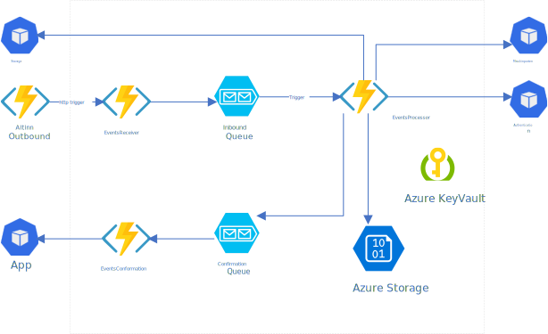

# Application Owner System
A reference implementation of a system for app owners, that can react to events, fetch data and update app status.

## Architecture

The system is implemented as Azure Functions using .Net 5

- It uses Azure Functions to receive, process, and confirm downloading of data
- It uses Azure Queue Storage for async processing
- It uses Azure Blob Storage to store data.
- It uses Azure KeyVault to store the certificate for [MaskinPorten](https://www.digdir.no/digitale-felleslosninger/maskinporten/869)



### Events Receiver

The events receiver is a webhook that receives events from Altinn Events.

It will put the received Event in a Queue based on Azure Queue Storage.

The function is protected by a [Function Access Key](https://docs.microsoft.com/en-us/azure/azure-functions/functions-bindings-http-webhook-trigger?tabs=csharp#authorization-keys). This needs to be present in URI in requests from Altinn events. 

The endpoint for subscription needs to include it. 
Example: https://aos-ttdt22-function.azurewebsites.net/api/eventsreceiver?code=ffQqMrbvLoNEiySae0EfApmost8LfBeqdYY/AXa13KSyf8Rjsp1U9w==

Azure creates the code when setting up the functions.

### Events Processor

Events processor is responsible to

- Download Instance document
- Download all data and store it as blobs in an Azure Storage Account

Put events on the feedback queue

### Events Feedback

Events feedback is responsible for

- Upload xml feedback to a datafield controlled by the setting: AltinnApplicationOwnerSystemSettings:XMLFeedbackDataType
- Put events on the confirmation queue

In addition to configure the XMLFeedbackDataType you also need to specify the type of events that should trigger upload of feedback. Controlled with the setting: AltinnApplicationOwnerSystemSettings:XMLFeedbackEventType

### Events Confirmation

- Calls App to confirm that data is downloaded (and feedback uploaded if configured)

### Events Subscriber

Events subscriber is triggered when a file is uploaded to the blob container add-subscriptions

Events subscriber is responsible for:

- Authenticate with maskinporten to altinn3 and register the subscription uploaded
- Saving the response from altinn3 to the blob container active-subscriptions
- Deleting the uploaded file in add-subscriptions

### Events DeSubscriber

Events desubscriber is triggered when a file is uploaded to the blob container: remove-subscriptions

The simplest way to get the json to upload is to download it form the blob container: active-subscriptions 

Events Desubscriber is responsible for:

- Authenticate with maskinporten to altinn3 and remove the subscription uploaded
- Removing the file describing the subscription in active-subscriptions
- Deleteing the uploaded file in remove-subscriptions

## Authentication

The system uses Maskinporten to authenticate the application owner.

- The org needs to be registered as a client 

## Configuration

As part of this project, you find a PowerShell script to deploy the solution to an Azure Subscription

### Prerequisites

- You have an Azure subscription that you can log in to and create resources
- Org is registred with a client in MaskinPorten and you have the clientId
- You have the certificate for that client with password
- The client is an application owner in Altinn

From deployment folder run in Powershell. Replace values matching your environment
Example: #  

   ```bash
.\provision_application_owner_system.ps1 -subscription Altinn-TTD-Application-Owner-System -aosEnvironment [INSERT NAME ON ENVIRONMENT MAX 5 letters] -maskinportenclient [INSERT MASKINPORTEN CLIENTID] -maskinportenclientcert [PATH TO CERT] -maskinportenclientcertpwd [INSERT PASSOWORD FOR CERT] -maskinportenuri https://ver2.maskinporten.no -platformuri https://platform.tt02.altinn.no/ -appsuri https://ttd.apps.tt02.altinn.no/
   ```


### Setting up a subscription

Below you see and example on how an subscription is set up. This need to be posted to the subscription endpoint while authenticated as org.

See more details on [Subscription API](https://docs.altinn.studio/teknologi/altinnstudio/altinn-api/platform-api/events/)

```json
{
    "endPoint": "https://aos-ttdtt02-function.azurewebsites.net/api/eventsreceiver?code=swEizasdgraeadvcvvwFAKE8y9ZS7bDoZNOTREALLuPeJMkUtHow==",
    "sourceFilter": "https://ttd.apps.tt02.altinn.no/ttd/apps-test",
    "typeFilter": "app.instance.process.completed",
   }

 ```

### Altinn 3 documentation


Here you find relevant information.
- [Altinn 3 documentation](https://docs.altinn.studio/technology/)
- [Altinn 3 API](https://docs.altinn.studio/api/)
- [Altinn 3 Event capabilities](https://docs.altinn.studio/technology/architecture/capabilities/runtime/integration/events/)
